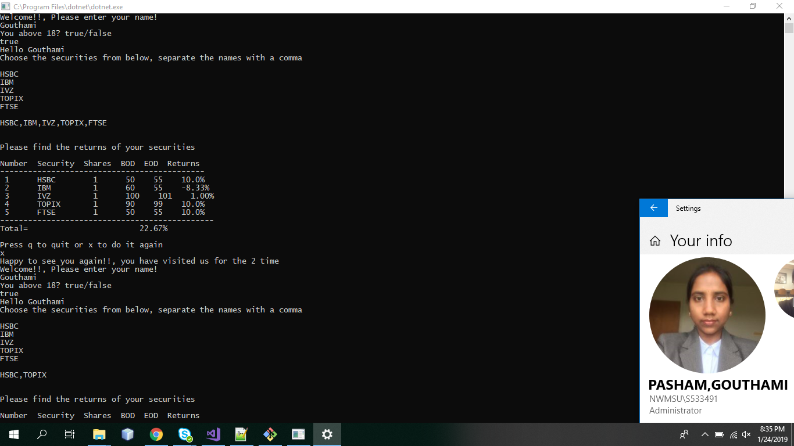

# My_First_C-
	This project is about investments. As soon as the user enters the applicaton, the user is asked to select the securities he want to invest in. Once the security code is entered. The security returns as well as the profit earned on that portfolio is shown in the output.

#output of the program:
